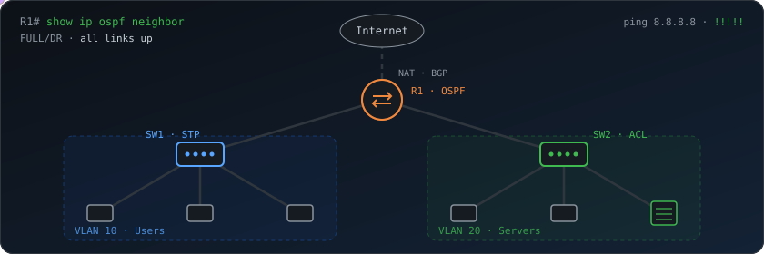

<p align="center">
  <a href="https://github.com/ffran44">
    
  </a>
</p>

<p align="center">
  <a href="https://portfolio-rissonefran.vercel.app/"></a>
  <a href="https://www.linkedin.com/in/rissonefran/"></a>
  <a href="https://www.credly.com/users/francisco-rissone"></a>
  <a href="mailto:rissonefran@gmail.com"></a>
  
</p>

<p align="center">
  
</p>

### 👋 About me

```yaml
name:      Francisco Rissone
location:  Río Tercero, Córdoba, Argentina 🇦🇷  (UTC-3)
role:      IT Technician · Network & Infrastructure
certs:     [CCNA 1/2/3, English for IT 1 & 2]
studying:  Telecommunications @ UTN FRC
teaching:  Cryptography, security, data structures & PHP @ ITR3
languages: [Spanish (native), English (B1+)]
available: remote · hybrid · on-site
```

### 🧰 Tech stack

<details open>
<summary><b>🌐 Networking</b></summary>
<br>


`VLAN` `Trunking` `OSPF` `BGP (lab)` `NAT/PAT` `DHCP` `ACLs` `STP/RSTP` `EtherChannel` `SNMP` `SSH` `Subnetting`

</details>

<details open>
<summary><b>🖥️ Systems & automation</b></summary>
<br>


</details>

<details open>
<summary><b>💻 Development</b></summary>
<br>


</details>

### 🚀 Featured projects

<details>
<summary><b>🌍 Portfolio</b> — personal site built with Next.js</summary>
<br>

My personal portfolio: Next.js + TypeScript + Tailwind CSS + shadcn/ui, deployed on Vercel.
<br>
🔗 [Live site](https://portfolio-rissonefran.vercel.app/) · 📁 [Repository](https://github.com/ffran44/Portfolio)

</details>

<details>
<summary><b>🎓 Tiny Devs Academy</b> — academy website</summary>
<br>

Website for Tiny Devs Academy: Next.js 16, React 19, Tailwind CSS 4 and Framer Motion animations.
<br>
📁 [Repository](https://github.com/ffran44/tinydevsacademy)

</details>

<details>
<summary><b>🔌 Integrative network topology</b> — full Cisco lab in Packet Tracer</summary>
<br>

End-to-end topology implementing **VLANs, ACLs, SSH hardening, STP, OSPF, SVIs, EtherChannel, NAT, DHCP** and a **WAN segment with BGP**.

</details>

### 📈 Activity

<p align="center">
  
</p>

<p align="center">
  <picture>
    <source media="(prefers-color-scheme: dark)" srcset="https://raw.githubusercontent.com/ffran44/ffran44/output/github-snake-dark.svg">
    <source media="(prefers-color-scheme: light)" srcset="https://raw.githubusercontent.com/ffran44/ffran44/output/github-snake.svg">
    
  </picture>
</p>


